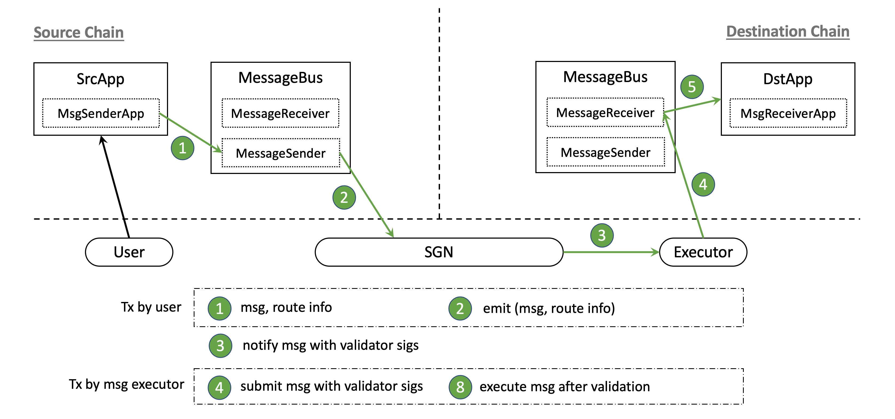

# cBridge General Message Passing 

**Note: cBridge general message passing module is work in progess, and is subject to change in later iterations**

* [End-to-End Flow](#end-to-end-flow)
* [Application Framework](#application-framework)
* [Fee Mechanims](#fee-mechanism)

## End-to-End Flow

### Cross-chain message passing with token transfer
SrcApp at source chain wants to send some tokens to DstApp at destination chain, along with an arbitrary message associated with the transfer. Figure below describes the end-to-end flow about such transfers. The SrcApp sends both cross-chain token transfer and message passing requests in the same transaction. SGN catches and correlates both events, and completes the token transfer at destination chain. The executor then submits the SGN-signed message and token transfer info to the message bus at the destination chain, which will verify the submitted info and call DstApp to execute the message.

### Cross-chain message passing only

SrcApp at source chain wants to send an arbitrary message to DstApp at destination chain without associated token transfer. Figure below describes the end-to-end flow, which is a subset of the above flow.

## Application Framework

We provide the [message bus contract](./messagebus) and  [application framework](./framework) which implements the common process of message passing, including send, receive, and validate messages and token transfers. After inherent the app framework contracts, **the app developers only needs to focus on the app-specific logics.**

- To send cross-chain message and token transfer, the app needs to inherent [MsgSenderApp.sol](./framework/MsgSenderApp.sol) and call the utils functions. 
- To receive cross-chain message and token transfer, the app needs to inherent [MsgReceiverApp.sol](./framework/MsgReceiverApp.sol) and implement its virtual functions.

### Example: Batch Token Transfer

We implemented an [example application](./apps/BatchTransfer.sol) using our framework to batch multiple cross-chain token transfers to different receivers into a single cross-chain transfer. The high-level workflow consists of three steps:

1. Sender side calls `batchTransfer` at source chain, which internally calls app framework's `sendMessageWithTransfer` to send message and tokens.
2. Receiver side implements the `executeMessageWithTransfer` interface to handle the batch transfer message, and distribute tokens to receiver accounts according to the message content. It also internally calls app framework's `sendMessage` to send a receipt to the source app.
3. Sender side implements the `executeMessage` interface to handle the receipt message.

## Fee Mechanism

**[Work In Progress]** SGN charges fee to sync, sign, and store messages. Executor charges fee to submit execute message transactions.